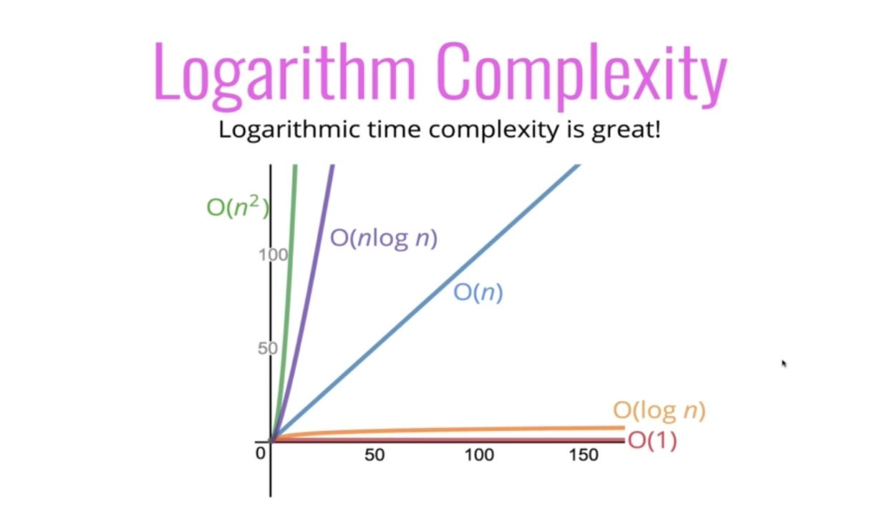

# Big O Notation

### What does better mean?

- Faster?
- Less memory-intensive?
- More readable?

### The Problem With Time

- Different machines will record different times!
- The same machine will record different times!
- For fast algorithms, speed measurements may not be precise enough?

Rather than counting seconds, which are so variable...
Let's count the number of simple operations the computer has to perform

### Big O Definition

We say that an algorithm is O(f(n)) if the number of simple operations the computer has to do is eventually less than a constant times f(n), as n increases

- f(n) could be linear (f(n) = n)
- f(n) could be quadratic (f(n) = n2)
- f(n) could be constant (f(n) = 1)
- f(n) could be something entirely different!

### Constants Don't Matter

- ~~O(2n)~~ &#8594; O(n)
- ~~O(500)~~ &#8594; O(1)
- ~~O(13n2)~~ &#8594; O(n2)

### Smaller Terms Don't Matter

- ~~O(n + 10)~~ &#8594; O(n)
- ~~O(1000n + 50)~~ &#8594; O(n)
- ~~O(n2 + 5n + 8)~~ &#8594; O(n2)

### Big O Shorthands

- Arithmetic operations are constant
- Variable assignment is constant
- Accessing elements in an array (by index) or object (by key) is constant
- In a loop, the complexity is the length of the loop times the complexity of whatever happens inside of the loop

### Space Complexity in JS

- Most primitives (booleans, numbers, undefined, null) are constant space
- Strings require O(n) space (where n is the string length)
- Reference types are generally O(n), where n is the length (for arrays) or the number of keys (for objects)

### Logarithms

- log2(8) = 3 &#8594; 23 = 8
- log2(value) = exponent &#8594; 2exponent = value
- log === log2

### Who Cares?

- Certain searching algorithms have logarithmic time complexity
- Efficient sorting algorithms involve logarithms
- Recursive sometimes involves logarithmic space complexity

